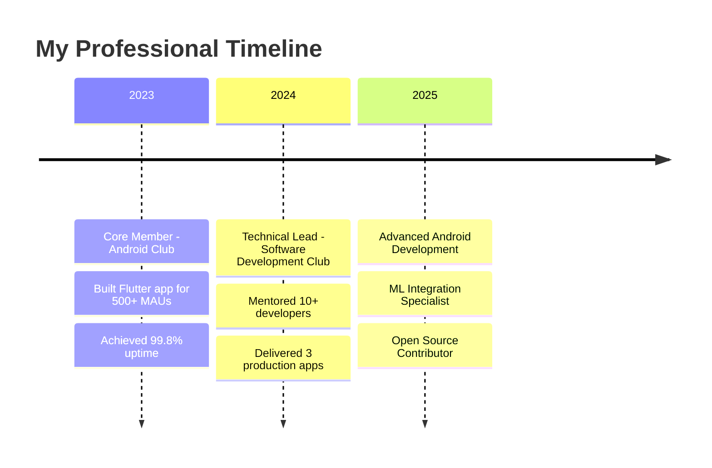

#  Hey there! I'm Rudraksh

<div align="center">
  
</div>

<div align="center">
  
</div>

<div align="center">
  
<!-- Modern badges with glow effect -->


</div>

<br>

<div align="center">
  
</div>

##  About Me

<div align="center">
<table>
<tr>
<td width="50%">

```kotlin
class AndroidDeveloper {
    val name = "Rudraksh"
    val role = "Android Developer"
    val location = "📍 Vellore, India"
    val education = "🎓 B.Tech CSE @ VIT"
    val status = "💼 Open to opportunities"
    
    val currentlyLearning = listOf(
        "🚀 Advanced Jetpack Compose",
        "🤖 Machine Learning on Mobile", 
        "🏗️ Clean Architecture",
        "📱 Kotlin Multiplatform"
    )
    
    val expertise = mapOf(
        "Mobile" to "Android, Flutter, Kotlin",
        "Backend" to "Firebase, Azure, AWS",
        "AI/ML" to "TensorFlow Lite, Python",
        "Other" to "IoT, Cloud Integration"
    )
    
    fun getContact() = "rudrakshofficial2610@gmail.com"
    
    fun getDailyRoutine() = """
        ☕ Coffee.brew()
        💻 Code.write()
        🐛 Bugs.debug()
        🔄 repeat()
    """
}
```

</td>
<td width="50%">

### 🎯 Quick Stats
- 📱 **5+** Android Projects
- ⭐ **1000+** Lines of Code
- 🏆 **Top 1.1%** LeetCode Rank  
- 👥 **10+** Developers Mentored

### 🔥 Current Focus
```diff
+ Building scalable Android apps
+ Exploring ML on mobile devices  
+ Contributing to open source
+ Mastering Jetpack Compose
```

### 💭 Fun Facts
- 🌙 I code better at night
- 🎮 Gaming enthusiast  
- 📚 Love reading tech blogs
- ☕ Coffee == Code fuel

### 📈 This Week
```
Android Development  ████████████████████ 60%
Learning ML         ████████████░░░░░░░░ 25%
Open Source        ██████░░░░░░░░░░░░░░ 10%
Documentation      ██░░░░░░░░░░░░░░░░░░ 5%
```

</td>
</tr>
</table>
</div>

<div align="center">
  
</div>

##  Tech Arsenal

<div align="center">

### Languages & Frameworks


### Cloud & Databases  


### Development Tools


</div>

<div align="center">
  
</div>

##  Featured Projects

<div align="center">

<table width="100%">
<tr>
<td width="50%">

### ⌨️ SpeedBoard: Bluetooth HID
**Performance Beast**
- ⚡ <50ms latency
- 🎯 99.9% uptime  
- 📱 95% device compatibility
- 🏗️ MVVM Architecture

[](https://github.com/Rudraksh2605/SpeedBoard)

</td>
<td width="50%">

### 🧑‍💻 DevStore Platform  
**Developer Hub**
- 👥 1,000+ registrations
- 🔒 Secure APK distribution
- 📊 Advanced analytics
- 🚀 Version control

[](https://github.com/Rudraksh2605/DevStore)

</td>
</tr>
<tr>
<td width="50%">

### 🏥 SkinDoc: AI Dermatology
**Medical Innovation**
- 🤖 90% AI accuracy
- ⚡ 5min diagnosis time
- 📱 TensorFlow Lite
- 🔥 Firebase backend

[](https://github.com/Rudraksh2605/SKINDOC)

</td>
<td width="50%">

### 🌡️ TEMPSOR: IoT Monitor
**Smart Solutions**
- 📊 98% data accuracy
- ☁️ Azure integration
- 💰 40% cost reduction
- 🔍 5x faster detection

[](https://github.com/Rudraksh2605/TEMPSOR)

</td>
</tr>
</table>

</div>

<div align="center">
  
</div>

##  GitHub Analytics

<div align="center">
  
  
</div>

<div align="center">
  
</div>

##  Achievements & Recognition

<div align="center">

| 🏆 **Achievement** | 🎯 **Details** | 📊 **Impact** |
|:--:|:--:|:--:|
| **HPE Think-A-Thon 2025** | 6th Position | 250+ Participants |
| **LeetCode Contest 468** | Top 1.1% Globally | 402/36,350 Rank |
| **GeeksForGeeks** | Top 20.1% | Technical Excellence |
| **Technical Lead** | Software Dev Club | Team Leadership |

</div>

<div align="center">
  
</div>

##  Professional Journey

<div align="center">



</div>

##  Let's Build Something Amazing Together!

<div align="center">

### Connect with me across the digital universe 🌐

<a href="https://linkedin.com/in/rudraksh261005">
  
</a>
<a href="mailto:rudrakshofficial2610@gmail.com">
  
</a>
<a href="https://github.com/Rudraksh2605">
  
</a>

<br><br>

### 💫 Random Dev Quote


<br>

### 🎵 When I'm Coding
<div align="center">

<br><br>
<i>🎧 The Way I AM - Charlie Puth</i>
<br>
<i>"Good code needs good music"</i> 🎶
</div>

</div>

<div align="center">
  
</div>

<div align="center">
  
  
  **⭐ If you find my work interesting, drop a star!**
  
  <br>
  
  *"Code is poetry written in logic"* 💙
</div>
